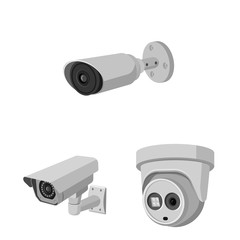

<!DOCTYPE html>
<html lang="en">
<head>
    <meta charset="UTF-8">
    <meta http-equiv="X-UA-Compatible" content="IE=edge">
    <meta name="viewport" content="width=device-width, initial-scale=1.0">
    <title>FirstYou Service</title>
    <link rel="stylesheet" href="./Style/Service/Style-Service.css">
</head>
<body>
    <nav class="navbar">
        
        

FirstYou
  
Company

        

        <a href="#">Blog</a>
        <a href="#">Login/Sign Up</a>
        

    </nav>
    

        

            
            
CCTV Installlation Service

        

    

</body>
</html>
